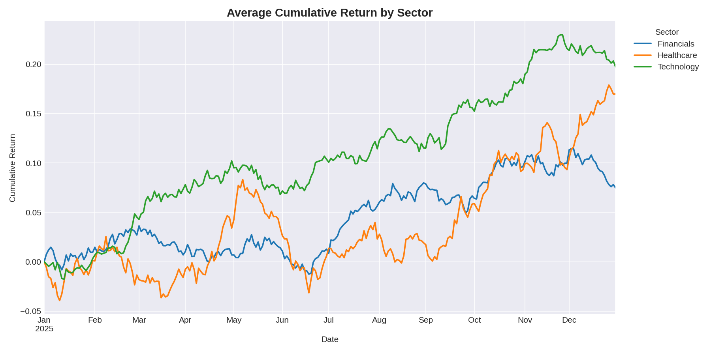

# 📈 Stock Market Trend Analysis

A real-time stock data pipeline and analytics toolkit built with **Python, Pandas, Matplotlib, and the yFinance API**. It ingests and processes market data for 50+ stocks across six sectors, engineers analytical features (moving averages, daily returns, volatility, volume trends), and produces comparative multi-sector visualizations — all through a single automated ETL job.


*Example output: average cumulative return by sector (chart generated with simulated demo data — see [Note](#note-on-sample-data) below).*

## Features

- **Real-time data ingestion** — pulls OHLCV data for 60 tickers across Technology, Financials, Healthcare, Energy, Consumer, and Industrials sectors via the yFinance API, in rate-limit-friendly batches.
- **Analytical feature engineering**
  - Moving averages (20/50/200-day)
  - Daily & cumulative returns
  - Rolling annualized volatility
  - Volume trend / relative-volume ratio
- **Comparative multi-sector visualizations** — cumulative return by sector, volatility distribution boxplots, top gainers/losers, per-ticker moving average and volume charts.
- **End-to-end automated ETL** — one command (`python main.py`) runs extract → transform → load → report; a GitHub Actions workflow can run it on a schedule for continuous trend monitoring with no manual intervention.

## Project structure

```
stock-market-trend-analysis/
├── config.py              # Ticker universe (sectors), paths, analysis parameters
├── data_pipeline.py        # Extract: yFinance ingestion, batching, error handling
├── analysis.py              # Transform: moving averages, returns, volatility, volume
├── visualize.py              # Report: Matplotlib comparative charts
├── main.py                    # Orchestrates the full ETL pipeline
├── requirements.txt
├── data/                       # Raw & processed CSVs (generated, git-ignored)
├── outputs/                    # Generated PNG charts (generated, git-ignored)
├── docs/                        # Static assets for this README
└── .github/workflows/
    └── daily_run.yml             # Scheduled automated pipeline run
```

## Getting started

```bash
# 1. Clone the repo
git clone https://github.com/<your-username>/stock-market-trend-analysis.git
cd stock-market-trend-analysis

# 2. Install dependencies
pip install -r requirements.txt

# 3. Run the full pipeline
python main.py
```

This will:
1. Fetch ~1 year of daily price data for 60 tickers from yFinance
2. Compute moving averages, returns, volatility, and volume metrics
3. Save `data/raw_prices.csv` and `data/processed_metrics.csv`
4. Save charts to `outputs/` (sector returns, volatility boxplot, top movers, and per-ticker detail charts)
5. Print a sector performance summary table to the console

### Customizing the ticker universe

Edit `SECTOR_TICKERS` in `config.py` to add/remove tickers or sectors. `main.py` and every module downstream will pick up the change automatically.

### Running individual stages

```bash
python data_pipeline.py   # just the extract step -> data/raw_prices.csv
python analysis.py         # transform data/raw_prices.csv -> data/processed_metrics.csv
python visualize.py         # generate charts from data/processed_metrics.csv
```

## Automated continuous monitoring

`.github/workflows/daily_run.yml` runs the pipeline automatically on weekdays after market close and commits the refreshed data/charts back to the repo. Enable it by pushing this repo to GitHub — no extra setup required. Trigger it manually any time from the **Actions** tab (`workflow_dispatch`).

## Tech stack

| Tool | Purpose |
|---|---|
| **yFinance** | Free real-time & historical market data API |
| **Pandas** | Data wrangling, feature engineering, aggregation |
| **Matplotlib** | Comparative sector/ticker visualizations |
| **GitHub Actions** | Scheduling the ETL job for continuous monitoring |

## Note on sample data

The chart above was generated from simulated price series (for demo/CI purposes, since sandboxed environments can't always reach `finance.yahoo.com`). Running `python main.py` on your own machine pulls **live data** from yFinance and produces real charts in `outputs/`.

## License

MIT — feel free to fork and extend.
